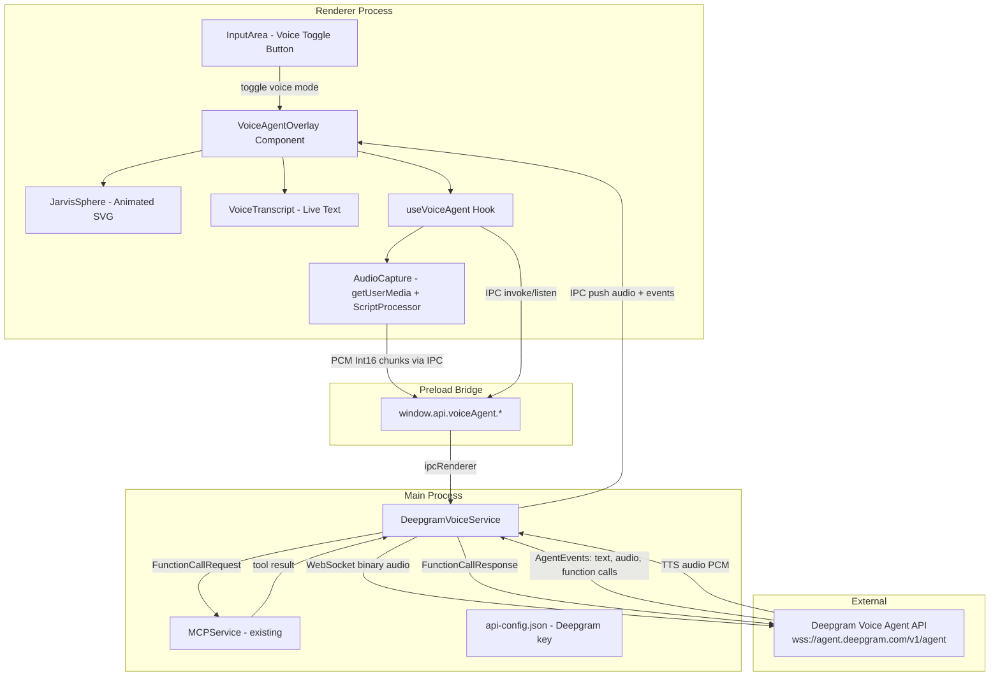
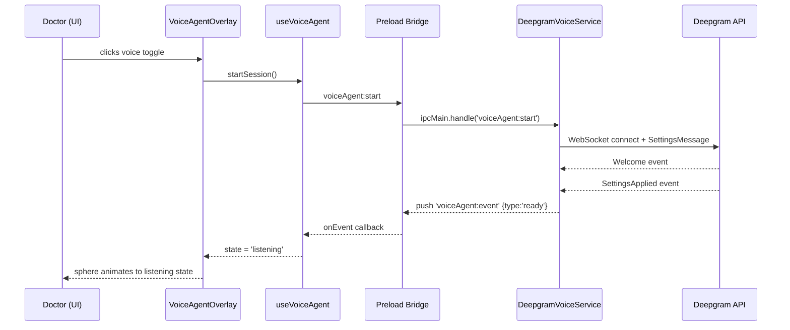
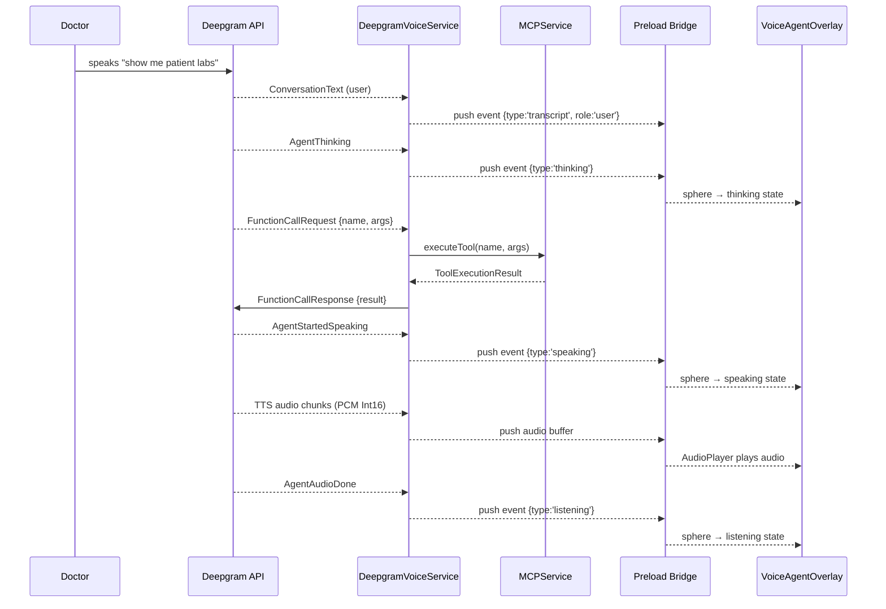

# Design Document: Jarvis Voice Agent

## Overview

The Jarvis Voice Agent replaces Opax's text-based microphone button with a real-time, bidirectional voice interaction system powered by Deepgram's Voice Agent API V1 (WebSocket). Doctors can activate a full-screen "Jarvis mode" featuring an animated sphere that reacts to conversation state (idle, listening, thinking, speaking), while the agent transcribes speech, reasons via an LLM, executes MCP tool calls in real time, and speaks responses back — all without leaving the clinical workflow.

The feature is designed as a layered addition on top of the existing Electron IPC architecture: a new `DeepgramVoiceService` in the main process manages the WebSocket lifecycle and MCP tool bridging, a new set of IPC channels expose it to the renderer, and a new `VoiceAgentOverlay` React component provides the Jarvis UI with the animated sphere and live transcript.

## Architecture



## Sequence Diagrams

### Session Start Flow



### Real-Time Tool Call Flow




## Components and Interfaces

### Component 1: DeepgramVoiceService (Main Process)

**Purpose**: Owns the Deepgram WebSocket connection, routes audio in/out, handles all AgentEvents, and bridges FunctionCallRequests to MCPService.

**Interface**:
```typescript
interface DeepgramVoiceServiceConfig {
  deepgramApiKey: string
  llmProvider: 'openai' | 'gemini'
  llmApiKey: string
  llmModel: string          // e.g. 'gpt-4o-mini'
}

interface VoiceAgentEvent {
  type: 'ready' | 'listening' | 'thinking' | 'speaking' | 'transcript' | 'error' | 'done'
  transcript?: { role: 'user' | 'agent'; text: string }
  error?: string
}

class DeepgramVoiceService {
  start(config: DeepgramVoiceServiceConfig): Promise<void>
  stop(): Promise<void>
  sendAudio(pcmInt16Buffer: Buffer): void
  keepAlive(): void
  isActive(): boolean
  on(event: 'agentEvent', listener: (e: VoiceAgentEvent) => void): void
  on(event: 'audioChunk', listener: (pcm: Buffer) => void): void
}
```

**Responsibilities**:
- Open WebSocket to `wss://agent.deepgram.com/v1/agent` with Authorization header
- Send initial `SettingsMessage` configuring STT (nova-3), TTS (aura-2-thalia-en), LLM, and MCP tools as functions
- Forward incoming PCM audio from renderer to WebSocket as binary frames
- Parse all incoming AgentEvents and emit typed events to IPC
- On `FunctionCallRequest`: call `MCPService.executeTool()`, then send `FunctionCallResponse` back to Deepgram
- Send keep-alive ping every 5 seconds while session is active
- Gracefully close WebSocket on `stop()`

---

### Component 2: useVoiceAgent Hook (Renderer)

**Purpose**: React hook that manages the full voice session lifecycle from the renderer side — microphone capture, IPC communication, audio playback, and state machine.

**Interface**:
```typescript
type VoiceAgentState = 'idle' | 'connecting' | 'listening' | 'thinking' | 'speaking' | 'error'

interface TranscriptEntry {
  id: string
  role: 'user' | 'agent'
  text: string
  timestamp: number
}

interface UseVoiceAgentReturn {
  state: VoiceAgentState
  transcript: TranscriptEntry[]
  error: string | null
  startSession(): Promise<void>
  stopSession(): Promise<void>
}

function useVoiceAgent(): UseVoiceAgentReturn
```

**Responsibilities**:
- Call `window.api.voiceAgent.start()` with config loaded from localStorage
- Capture microphone via `getUserMedia({ audio: true })`
- Use `AudioContext` + `ScriptProcessorNode` (or `AudioWorklet`) to produce 24kHz linear16 PCM chunks
- Send PCM chunks to main process via `window.api.voiceAgent.sendAudio(buffer)`
- Listen for `voiceAgent:event` IPC pushes and update `state` + `transcript`
- Listen for `voiceAgent:audio` IPC pushes and enqueue PCM buffers for playback
- Play TTS audio via `AudioContext` (decode PCM Int16 → Float32 → AudioBuffer → play)
- Stop mic capture and call `window.api.voiceAgent.stop()` on session end

---

### Component 3: VoiceAgentOverlay (Renderer)

**Purpose**: Full-screen overlay UI that renders the Jarvis sphere, live transcript, and session controls.

**Interface**:
```typescript
interface VoiceAgentOverlayProps {
  isOpen: boolean
  onClose(): void
}

const VoiceAgentOverlay: React.FC<VoiceAgentOverlayProps>
```

**Responsibilities**:
- Render full-screen backdrop when `isOpen`
- Mount `JarvisSphere` component, passing current `state` for animation
- Render scrollable `VoiceTranscript` list showing live conversation
- Render stop/close button
- Animate in/out with framer-motion

---

### Component 4: JarvisSphere (Renderer)

**Purpose**: Animated SVG/Canvas sphere that visually reacts to voice agent state.

**Interface**:
```typescript
interface JarvisSphereProps {
  state: VoiceAgentState
  size?: number   // default 200
}

const JarvisSphere: React.FC<JarvisSphereProps>
```

**State → Animation Mapping**:
| State | Visual Behavior |
|-------|----------------|
| `idle` | Slow, gentle pulse; muted blue-grey |
| `connecting` | Rotating ring; amber |
| `listening` | Ripple waves expanding outward; sage green |
| `thinking` | Orbiting particles; soft white |
| `speaking` | Radial frequency bars pulsing; bright teal |
| `error` | Static red glow |

---

### Component 5: IPC Bridge Extensions (Preload)

New entries added to `window.api.voiceAgent`:

```typescript
interface VoiceAgentAPI {
  start(config: VoiceAgentStartConfig): Promise<{ success: boolean; error?: string }>
  stop(): Promise<{ success: boolean }>
  sendAudio(buffer: ArrayBuffer): void   // fire-and-forget, no invoke
  onEvent(callback: (event: VoiceAgentEvent) => void): void
  onAudio(callback: (pcm: ArrayBuffer) => void): void
  removeListeners(): void
}
```

`sendAudio` uses `ipcRenderer.send` (not `invoke`) to avoid round-trip overhead on every audio chunk.


## Data Models

### VoiceAgentStartConfig

```typescript
interface VoiceAgentStartConfig {
  deepgramApiKey: string
  llmProvider: 'openai' | 'gemini'
  llmApiKey: string
  llmModel: string
  systemPrompt?: string   // optional clinical context prompt
}
```

**Validation Rules**:
- `deepgramApiKey` must be non-empty string
- `llmProvider` must be `'openai'` or `'gemini'`
- `llmApiKey` must be non-empty string
- `llmModel` must be non-empty string

---

### DeepgramSettingsMessage

Sent once over WebSocket immediately after connection opens:

```typescript
interface DeepgramSettingsMessage {
  type: 'Settings'
  audio: {
    input:  { encoding: 'linear16'; sample_rate: 24000 }
    output: { encoding: 'linear16'; sample_rate: 24000; container: 'none' }
  }
  agent: {
    listen: { model: 'nova-3' }
    think: {
      provider: { type: 'open_ai' | 'google' }
      model: string
      instructions: string
      functions: DeepgramFunctionDef[]
    }
    speak: { model: 'aura-2-thalia-en' }
  }
}

interface DeepgramFunctionDef {
  name: string
  description: string
  parameters: {
    type: 'object'
    properties: Record<string, { type: string; description?: string }>
    required?: string[]
  }
}
```

---

### Deepgram Incoming Event Union

```typescript
type DeepgramIncomingEvent =
  | { type: 'Welcome';               message: string }
  | { type: 'SettingsApplied' }
  | { type: 'ConversationText';      role: 'user' | 'assistant'; content: string }
  | { type: 'UserStartedSpeaking' }
  | { type: 'AgentThinking' }
  | { type: 'AgentStartedSpeaking' }
  | { type: 'AgentAudioDone' }
  | { type: 'FunctionCallRequest';   function_call_id: string; function_name: string; input: Record<string, unknown> }
  | { type: 'Error';                 message: string; code?: string }
```

Binary frames (no JSON type field) are raw PCM Int16 audio from TTS.

---

### api-config.json Extension

The existing `api-config.json` in `userData` gains one new field:

```typescript
interface ApiConfig {
  // ... existing fields ...
  deepgramApiKey?: string
}
```

Stored and loaded via the existing `api:setKeys` / `api:getStatus` IPC pattern.

---

### TranscriptEntry (Renderer State)

```typescript
interface TranscriptEntry {
  id: string           // uuid
  role: 'user' | 'agent'
  text: string
  timestamp: number    // Date.now()
}
```


## Algorithmic Pseudocode

### Algorithm 1: DeepgramVoiceService.start()

```pascal
PROCEDURE start(config: DeepgramVoiceServiceConfig)
  INPUT: config with deepgramApiKey, llmProvider, llmApiKey, llmModel
  OUTPUT: void (throws on failure)

  PRECONDITIONS:
    - config.deepgramApiKey is non-empty
    - config.llmApiKey is non-empty
    - no active session (isActive() = false)

  POSTCONDITIONS:
    - WebSocket is open and SettingsApplied received
    - keepAlive interval is running
    - isActive() = true

  BEGIN
    IF isActive() THEN
      CALL stop()
    END IF

    mcpTools ← MCPService.getAllTools()
    functions ← MAP mcpTools TO DeepgramFunctionDef

    ws ← new WebSocket('wss://agent.deepgram.com/v1/agent', {
      headers: { Authorization: 'Token ' + config.deepgramApiKey }
    })

    ws.on('open') DO
      settingsMsg ← buildSettingsMessage(config, functions)
      ws.send(JSON.stringify(settingsMsg))
    END DO

    ws.on('message', data) DO
      IF data IS Buffer THEN
        emit('audioChunk', data)
      ELSE
        event ← JSON.parse(data)
        CALL handleAgentEvent(event)
      END IF
    END DO

    ws.on('error', err) DO
      emit('agentEvent', { type: 'error', error: err.message })
      CALL stop()
    END DO

    ws.on('close') DO
      emit('agentEvent', { type: 'done' })
      CALL clearKeepAliveInterval()
    END DO

    keepAliveInterval ← setInterval(5000) DO
      IF ws.readyState = OPEN THEN
        ws.send(JSON.stringify({ type: 'KeepAlive' }))
      END IF
    END DO

    this.ws ← ws
    this.active ← true
  END
```

---

### Algorithm 2: DeepgramVoiceService.handleAgentEvent()

```pascal
PROCEDURE handleAgentEvent(event: DeepgramIncomingEvent)
  INPUT: parsed JSON event from Deepgram WebSocket
  OUTPUT: void (side effects: IPC pushes, MCP calls)

  BEGIN
    MATCH event.type WITH
      CASE 'Welcome':
        // connection confirmed, wait for SettingsApplied
        LOG 'Deepgram connected'

      CASE 'SettingsApplied':
        emit('agentEvent', { type: 'ready' })
        emit('agentEvent', { type: 'listening' })

      CASE 'UserStartedSpeaking':
        emit('agentEvent', { type: 'listening' })

      CASE 'ConversationText':
        entry ← { role: event.role, text: event.content }
        emit('agentEvent', { type: 'transcript', transcript: entry })

      CASE 'AgentThinking':
        emit('agentEvent', { type: 'thinking' })

      CASE 'AgentStartedSpeaking':
        emit('agentEvent', { type: 'speaking' })

      CASE 'AgentAudioDone':
        emit('agentEvent', { type: 'listening' })

      CASE 'FunctionCallRequest':
        CALL handleFunctionCall(event.function_call_id, event.function_name, event.input)

      CASE 'Error':
        emit('agentEvent', { type: 'error', error: event.message })

      DEFAULT:
        LOG 'Unknown event type: ' + event.type
    END MATCH
  END
```

---

### Algorithm 3: DeepgramVoiceService.handleFunctionCall()

```pascal
PROCEDURE handleFunctionCall(callId: string, name: string, args: object)
  INPUT: function call details from Deepgram
  OUTPUT: void (sends FunctionCallResponse back to Deepgram)

  PRECONDITIONS:
    - ws is open
    - MCPService has tool named `name` OR tool not found (graceful error)

  POSTCONDITIONS:
    - FunctionCallResponse sent to Deepgram with output or error string
    - No exception propagates (errors are returned as output to agent)

  BEGIN
    TRY
      result ← AWAIT MCPService.executeTool(name, args)

      IF result.success THEN
        output ← result.result AS string OR JSON.stringify(result.result)
      ELSE
        output ← 'Tool error: ' + result.error
      END IF

    CATCH error
      output ← 'Tool execution failed: ' + error.message
    END TRY

    response ← {
      type: 'FunctionCallResponse',
      function_call_id: callId,
      output: output
    }

    ws.send(JSON.stringify(response))
  END
```

---

### Algorithm 4: useVoiceAgent Hook — Audio Capture Pipeline

```pascal
PROCEDURE startMicCapture()
  INPUT: none
  OUTPUT: running AudioContext pipeline sending PCM to main process

  PRECONDITIONS:
    - Browser has microphone permission
    - AudioContext API available

  POSTCONDITIONS:
    - 24kHz PCM Int16 chunks sent to main process every ~100ms
    - Cleanup function stored for teardown

  BEGIN
    stream ← AWAIT navigator.mediaDevices.getUserMedia({ audio: true })

    audioCtx ← new AudioContext({ sampleRate: 24000 })
    source ← audioCtx.createMediaStreamSource(stream)

    // ScriptProcessorNode: 4096 samples ≈ 170ms at 24kHz
    processor ← audioCtx.createScriptProcessor(4096, 1, 1)

    processor.onaudioprocess = (event) DO
      float32 ← event.inputBuffer.getChannelData(0)
      int16 ← convertFloat32ToInt16(float32)
      window.api.voiceAgent.sendAudio(int16.buffer)
    END DO

    source.connect(processor)
    processor.connect(audioCtx.destination)

    // Store for cleanup
    this.micStream ← stream
    this.audioCtx ← audioCtx
    this.processor ← processor
  END

FUNCTION convertFloat32ToInt16(float32: Float32Array): Int16Array
  int16 ← new Int16Array(float32.length)
  FOR i FROM 0 TO float32.length - 1 DO
    // Clamp to [-1, 1] then scale to Int16 range
    clamped ← MAX(-1, MIN(1, float32[i]))
    int16[i] ← FLOOR(clamped * 32767)
  END FOR
  RETURN int16
```

---

### Algorithm 5: TTS Audio Playback Queue

```pascal
PROCEDURE enqueuePCMAudio(pcmBuffer: ArrayBuffer)
  INPUT: raw PCM Int16 audio from Deepgram TTS
  OUTPUT: audio played through speakers in order

  PRECONDITIONS:
    - AudioContext is initialized

  POSTCONDITIONS:
    - Audio plays without gaps or overlap
    - Queue drains in FIFO order

  BEGIN
    audioQueue.push(pcmBuffer)

    IF NOT isPlaying THEN
      CALL drainQueue()
    END IF
  END

PROCEDURE drainQueue()
  BEGIN
    IF audioQueue.isEmpty() THEN
      isPlaying ← false
      RETURN
    END IF

    isPlaying ← true
    pcm ← audioQueue.dequeue()

    // Convert Int16 PCM → Float32
    int16 ← new Int16Array(pcm)
    float32 ← new Float32Array(int16.length)
    FOR i FROM 0 TO int16.length - 1 DO
      float32[i] ← int16[i] / 32768.0
    END FOR

    audioBuffer ← audioCtx.createBuffer(1, float32.length, 24000)
    audioBuffer.copyToChannel(float32, 0)

    source ← audioCtx.createBufferSource()
    source.buffer ← audioBuffer
    source.connect(audioCtx.destination)
    source.onended ← () DO CALL drainQueue() END DO
    source.start()
  END
```


## Key Functions with Formal Specifications

### DeepgramVoiceService.start()

```typescript
async start(config: DeepgramVoiceServiceConfig): Promise<void>
```

**Preconditions:**
- `config.deepgramApiKey` is a non-empty string
- `config.llmApiKey` is a non-empty string
- `this.isActive()` is `false` (no concurrent session)

**Postconditions:**
- WebSocket connection is open to Deepgram
- `SettingsMessage` has been sent
- Keep-alive interval is running at 5s
- `this.isActive()` returns `true`
- If any step fails, `stop()` is called and error is thrown

**Loop Invariants:** N/A (event-driven, not loop-based)

---

### DeepgramVoiceService.handleFunctionCall()

```typescript
private async handleFunctionCall(
  callId: string,
  name: string,
  args: Record<string, unknown>
): Promise<void>
```

**Preconditions:**
- `callId` is a non-empty string
- `this.ws` is open

**Postconditions:**
- Exactly one `FunctionCallResponse` message is sent to Deepgram for this `callId`
- The response contains either the tool result or a descriptive error string
- No exception propagates out of this function

---

### DeepgramVoiceService.sendAudio()

```typescript
sendAudio(pcmBuffer: Buffer): void
```

**Preconditions:**
- `pcmBuffer` is a non-empty Buffer of PCM Int16 samples
- `this.isActive()` is `true`

**Postconditions:**
- Buffer is sent as a binary WebSocket frame if `ws.readyState === OPEN`
- Silently dropped if WebSocket is not open (no throw)

---

### useVoiceAgent.startSession()

```typescript
async startSession(): Promise<void>
```

**Preconditions:**
- `state` is `'idle'`
- `window.api.voiceAgent` is available
- Deepgram API key is present in localStorage

**Postconditions:**
- `state` transitions to `'connecting'` then `'listening'`
- Microphone capture is active
- IPC event listeners are registered
- On failure: `state` transitions to `'error'`, mic is released

---

### useVoiceAgent.stopSession()

```typescript
async stopSession(): Promise<void>
```

**Preconditions:**
- `state` is not `'idle'`

**Postconditions:**
- Microphone stream tracks are stopped
- AudioContext is closed
- `window.api.voiceAgent.stop()` is called
- IPC listeners are removed
- `state` transitions to `'idle'`
- `transcript` is preserved (not cleared)

---

### buildSettingsMessage()

```typescript
function buildSettingsMessage(
  config: DeepgramVoiceServiceConfig,
  mcpTools: MCPTool[]
): DeepgramSettingsMessage
```

**Preconditions:**
- `config` is valid
- `mcpTools` is an array (may be empty)

**Postconditions:**
- Returns a valid `DeepgramSettingsMessage` with all required fields
- `functions` array contains one entry per MCP tool
- `provider.type` is `'open_ai'` when `config.llmProvider === 'openai'`, `'google'` when `'gemini'`
- `instructions` includes a clinical context system prompt


## Example Usage

### Starting a Voice Session (Renderer)

```typescript
// In VoiceAgentOverlay.tsx
const { state, transcript, startSession, stopSession } = useVoiceAgent()

// Doctor clicks the Jarvis button
await startSession()
// state → 'connecting' → 'listening'
// JarvisSphere animates to listening state

// Doctor speaks: "What are the latest labs for patient Johnson?"
// state → 'thinking' (AgentThinking event)
// state → 'speaking' (AgentStartedSpeaking + TTS audio plays)
// transcript grows with user + agent entries
// state → 'listening' (AgentAudioDone)

// Doctor clicks stop
await stopSession()
// state → 'idle'
```

### Registering IPC Handlers (Main Process)

```typescript
// In index.ts
import { getDeepgramVoiceService } from './services/DeepgramVoiceService'
const voiceService = getDeepgramVoiceService()

ipcMain.handle('voiceAgent:start', async (_event, config: VoiceAgentStartConfig) => {
  try {
    await voiceService.start(config)
    return { success: true }
  } catch (error) {
    return { success: false, error: error.message }
  }
})

ipcMain.handle('voiceAgent:stop', async () => {
  await voiceService.stop()
  return { success: true }
})

// Fire-and-forget audio from renderer
ipcMain.on('voiceAgent:audio', (_event, buffer: Buffer) => {
  voiceService.sendAudio(buffer)
})

// Push events to renderer
voiceService.on('agentEvent', (event) => {
  mainWindow?.webContents.send('voiceAgent:event', event)
})

voiceService.on('audioChunk', (pcm) => {
  mainWindow?.webContents.send('voiceAgent:audio', pcm)
})
```

### Settings Modal — Deepgram Key Field

```typescript
// Added to ModelsTab in SettingsModal.tsx
const [deepgramApiKey, setDeepgramApiKey] = useState('')

// Saved alongside existing keys
await window.api.api.setKeys({
  openaiApiKey,
  geminiApiKey,
  deepgramApiKey,   // new field
  selectedModel,
  provider: selectedProvider,
})
```

### JarvisSphere Animation (framer-motion)

```typescript
const sphereVariants: Record<VoiceAgentState, TargetAndTransition> = {
  idle:       { scale: [1, 1.03, 1],    opacity: 0.6, transition: { repeat: Infinity, duration: 3 } },
  connecting: { rotate: 360,            opacity: 0.8, transition: { repeat: Infinity, duration: 1.5, ease: 'linear' } },
  listening:  { scale: [1, 1.12, 1],   opacity: 1.0, transition: { repeat: Infinity, duration: 0.8 } },
  thinking:   { scale: [1, 1.05, 1],   opacity: 0.9, transition: { repeat: Infinity, duration: 0.5 } },
  speaking:   { scale: [1, 1.2, 1],    opacity: 1.0, transition: { repeat: Infinity, duration: 0.3 } },
  error:      { scale: 1,              opacity: 0.7 },
}

<motion.div animate={sphereVariants[state]} className={`jarvis-sphere jarvis-sphere--${state}`} />
```


## Error Handling

### Error Scenario 1: WebSocket Connection Failure

**Condition**: Deepgram WebSocket fails to open (bad API key, network error, service down)
**Response**: `DeepgramVoiceService` emits `{ type: 'error', error: message }` event; IPC pushes to renderer; `useVoiceAgent` sets `state = 'error'`; mic is released
**Recovery**: Doctor sees error message in overlay; can retry by clicking voice button again

### Error Scenario 2: MCP Tool Execution Failure

**Condition**: `MCPService.executeTool()` returns `{ success: false }` or throws
**Response**: `handleFunctionCall` catches the error and sends a `FunctionCallResponse` with `output: 'Tool error: <message>'` — the agent receives this as a text result and can respond gracefully (e.g., "I couldn't retrieve the labs right now")
**Recovery**: Agent continues conversation; no session termination

### Error Scenario 3: Microphone Permission Denied

**Condition**: `getUserMedia` throws `NotAllowedError`
**Response**: `useVoiceAgent.startSession()` catches, sets `state = 'error'` with message "Microphone access denied"
**Recovery**: Overlay shows error; user must grant mic permission in OS settings

### Error Scenario 4: WebSocket Drops Mid-Session

**Condition**: `ws.on('close')` fires unexpectedly during active session
**Response**: `DeepgramVoiceService` emits `{ type: 'done' }`, clears keep-alive interval; renderer transitions to `'idle'`
**Recovery**: Session ends cleanly; transcript is preserved; doctor can start a new session

### Error Scenario 5: Missing Deepgram API Key

**Condition**: `voiceAgent:start` called but `deepgramApiKey` is empty
**Response**: IPC handler returns `{ success: false, error: 'Deepgram API key not configured' }` before attempting WebSocket
**Recovery**: `useVoiceAgent` sets `state = 'error'`; overlay prompts doctor to open Settings

## Testing Strategy

### Unit Testing Approach

- `DeepgramVoiceService`: mock `ws` (WebSocket), verify `SettingsMessage` structure, verify `FunctionCallResponse` is sent for each `FunctionCallRequest`, verify keep-alive fires at 5s intervals
- `buildSettingsMessage()`: pure function — test all LLM provider mappings, MCP tool → function def conversion, empty tools array
- `convertFloat32ToInt16()`: pure function — test clamping at ±1.0, scaling accuracy, array length preservation
- `useVoiceAgent` hook: use `@testing-library/react` + mock `window.api.voiceAgent`; test state machine transitions for all event types

### Property-Based Testing Approach

**Property Test Library**: fast-check (already in `node_modules`)

- `convertFloat32ToInt16`: for all `Float32Array` values in `[-1, 1]`, output Int16 values must be in `[-32767, 32767]`
- `buildSettingsMessage`: for any array of MCPTools, the resulting `functions` array length equals input length and each entry has `name`, `description`, `parameters`
- Audio queue: for any sequence of PCM buffers enqueued, all buffers are played exactly once in FIFO order

### Integration Testing Approach

- Mock Deepgram WebSocket server (using `ws` library in test) that replays a scripted event sequence: Welcome → SettingsApplied → UserStartedSpeaking → ConversationText → AgentThinking → FunctionCallRequest → AgentStartedSpeaking → [binary audio] → AgentAudioDone
- Verify `DeepgramVoiceService` emits the correct `VoiceAgentEvent` sequence
- Verify `MCPService.executeTool` is called with correct args on `FunctionCallRequest`
- Verify `FunctionCallResponse` is sent back to mock server

## Performance Considerations

- **Audio chunk size**: 4096 samples at 24kHz ≈ 170ms latency per chunk. This is acceptable for voice; smaller buffers increase IPC overhead.
- **IPC audio path**: `ipcRenderer.send` (not `invoke`) is used for audio to avoid round-trip overhead. Each chunk is ~8KB (4096 × 2 bytes).
- **TTS playback queue**: Sequential `AudioBufferSourceNode` chaining ensures gapless playback without blocking the main thread.
- **Keep-alive**: 5s interval is well within Deepgram's idle timeout; minimal overhead.
- **MCP tool calls**: Executed asynchronously; Deepgram's agent waits for `FunctionCallResponse` before continuing, so slow tools will delay the response. Existing 60s MCP timeout applies.

## Security Considerations

- **API key storage**: Deepgram key stored in `api-config.json` in `userData` (same pattern as OpenAI/Gemini keys). Never logged or sent to any server other than Deepgram.
- **WebSocket auth**: Authorization header uses `Token <key>` scheme; key is never embedded in the URL.
- **Microphone access**: Requested only when doctor explicitly activates voice mode; stream is stopped immediately on session end.
- **IPC channel security**: `voiceAgent:audio` uses `ipcMain.on` (not `handle`) — no response path, reducing attack surface. All other channels use `ipcMain.handle` with typed inputs.
- **MCP tool execution**: Tool calls originate from Deepgram's LLM reasoning, same trust level as existing text-mode tool calls. No additional privilege escalation.
- **Patient data**: Conversation audio is streamed to Deepgram's API. Doctors should be informed that voice data leaves the device (unlike text mode which uses local MCP tools). A consent notice should be shown on first activation.

## Dependencies

| Dependency | Purpose | Already Installed |
|---|---|---|
| `@deepgram/sdk` | Deepgram Voice Agent WebSocket client | No — needs `npm install @deepgram/sdk` |
| `framer-motion` | JarvisSphere animations | Yes |
| `ws` | WebSocket (Node.js, used by `@deepgram/sdk`) | Yes (transitive) |
| `uuid` | TranscriptEntry IDs | Yes |
| `fast-check` | Property-based tests | Yes |
| Web Audio API | Mic capture + TTS playback | Browser built-in |
| `getUserMedia` | Microphone access | Browser built-in |

The `@deepgram/sdk` package provides the `AgentEvents` enum and typed WebSocket client used in `DeepgramVoiceService`. Alternatively, the service can use the raw `ws` package with manual JSON parsing (no SDK dependency) — both approaches are valid; the SDK approach is preferred for type safety.


## Correctness Properties

*A property is a characteristic or behavior that should hold true across all valid executions of a system — essentially, a formal statement about what the system should do. Properties serve as the bridge between human-readable specifications and machine-verifiable correctness guarantees.*

### Property 1: State Machine Transitions

*For any* sequence of Deepgram AgentEvents delivered to the useVoiceAgent hook, the resulting VoiceAgentState must match the deterministic mapping defined by the state machine: `SettingsApplied` → `listening`, `UserStartedSpeaking` → `listening`, `AgentThinking` → `thinking`, `AgentStartedSpeaking` → `speaking`, `AgentAudioDone` → `listening`, `Error` → `error`, and `stop()` → `idle`.

**Validates: Requirements 1.2, 1.3, 1.4, 6.1, 6.2, 6.3, 6.4, 6.5**

---

### Property 2: SettingsMessage Structure Correctness

*For any* valid VoiceAgentStartConfig and any array of MCP tools (including empty), `buildSettingsMessage` must produce a DeepgramSettingsMessage where: the `functions` array length equals the number of MCP tools, each function entry contains `name`, `description`, and `parameters`, `provider.type` is `'open_ai'` when `llmProvider` is `'openai'` and `'google'` when `'gemini'`, and audio encoding is `linear16` at `24000` Hz.

**Validates: Requirements 2.2, 9.1, 9.2, 9.3, 9.4, 9.5**

---

### Property 3: FunctionCallResponse One-to-One Mapping

*For any* sequence of FunctionCallRequest events received by the DeepgramVoiceService (whether the tool succeeds, fails, or is not found), exactly one FunctionCallResponse must be sent to Deepgram for each request, matched by `function_call_id`, and no exception must propagate out of `handleFunctionCall`.

**Validates: Requirements 3.2, 3.3, 3.4, 3.5**

---

### Property 4: Float32-to-Int16 PCM Conversion Correctness

*For any* Float32Array input, `convertFloat32ToInt16` must produce an Int16Array of the same length where: values in `[-1.0, 1.0]` are scaled linearly to `[-32767, 32767]`, values greater than `1.0` are clamped to `32767`, and values less than `-1.0` are clamped to `-32767`.

**Validates: Requirements 11.1, 11.2, 11.3**

---

### Property 5: TTS Audio FIFO Playback Order

*For any* sequence of PCM Int16 audio buffers enqueued by the useVoiceAgent hook, the buffers must be played in the exact order they were received (FIFO), with each buffer starting only after the previous one has finished, and no buffer played more than once.

**Validates: Requirements 5.3, 5.4**

---

### Property 6: Transcript Accumulation

*For any* sequence of `ConversationText` events received during a session, the transcript array must grow by exactly one TranscriptEntry per event, each entry preserving the original role and text, and the array must not be cleared when the session ends.

**Validates: Requirements 6.6, 6.7**

---

### Property 7: API Key Persistence Round-Trip

*For any* Deepgram API key string saved via `api:setKeys`, retrieving it via `api:getStatus` must return the identical string, and the key must be stored in `api-config.json` without affecting the existing OpenAI or Gemini key values.

**Validates: Requirements 8.2, 8.3**

---

### Property 8: JarvisSphere Renders Distinct Animation Per State

*For any* VoiceAgentState value, the JarvisSphere component must render a visually distinct animation variant — no two states may produce the same CSS class, animation variant, or color value.

**Validates: Requirements 7.1, 7.2, 7.3, 7.4, 7.5, 7.6, 7.7**
