<p align="center">
  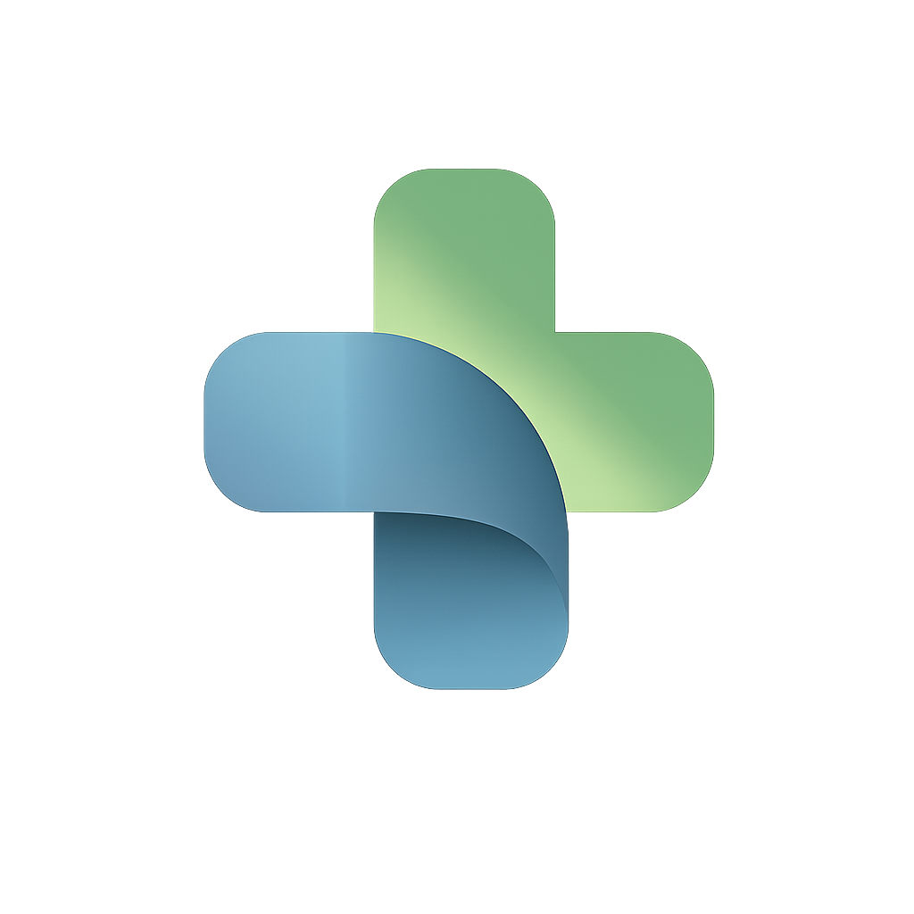
</p>

<h1 align="center">Opax</h1>

<p align="center">
  <strong>One conversation. Every hospital system. Privacy-first.</strong>
</p>

<p align="center">
  Opax replaces 6+ disconnected clinical apps with a single AI chat interface.<br/>
  Doctors talk naturally, MCP connects any system, smart cards render results instantly.<br/>
  3 hours of daily app-switching → 15 minutes.
</p>

<p align="center">
  <a href="https://github.com/manishindiyaar/Opax/releases">Download for Mac & Windows</a> •
  <a href="#features">Features</a> •
  <a href="#architecture">Architecture</a> •
  <a href="#getting-started">Getting Started</a>
</p>

---

## The Origin Story

It started in December 2025 with a small model called **FunctionGemma** — a lightweight 270M parameter model from Google that could run on a laptop or even a smartphone. That got us thinking.

Patient data is the most sensitive data there is. PHI (Protected Health Information) is the reason most developers never try to build automation on top of medicine. Every time you want to do something useful — schedule an appointment, pull lab results, check a patient record — you're forced to send that data to some external cloud service. And you have no idea if that service is actually HIPAA compliant. So most people just don't build it.

Our idea was simple: what if we fine-tuned FunctionGemma on clinical tool schemas so it could learn to make MCP (Model Context Protocol) calls to hospital systems — and everything runs locally on the doctor's device? No PHI ever leaves the machine.

We started building. Along the way, we found something bigger than just a local model. We found the real problem: **fragmentation**. Doctors don't just need a smarter AI — they need one place to access everything. EHR, scheduling, labs, pharmacy, staff directory, billing — all disconnected, all requiring separate logins, all wasting hours every day.

That's when Opax became what it is now: **a clinical orchestration platform that unifies every hospital system through MCP, accessible via natural language chat.**

The FunctionGemma local model didn't give us the quality we needed for reliable tool calling (yet — we're still working on it). But OpenAI and Gemini models worked perfectly through the same MCP architecture. The protocol doesn't care which model is behind it. That's the beauty of the design.

---

## The Problem

<p align="center">
  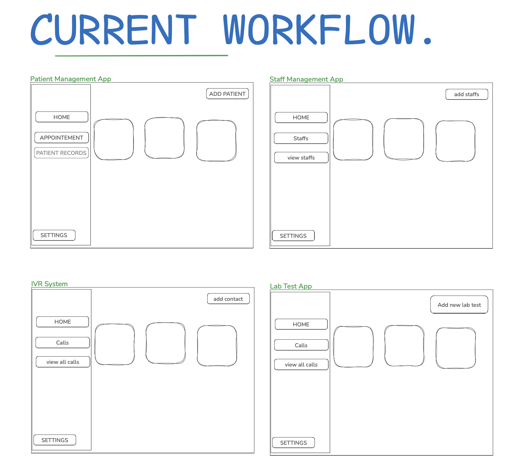
</p>

<p align="center">
  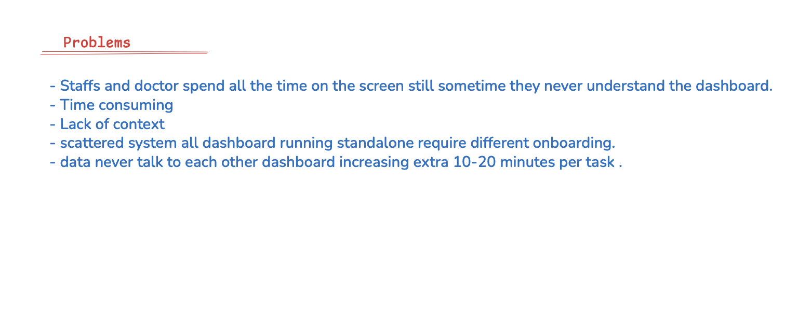
</p>

Clinicians lose roughly **30% of their shifts** navigating rigid, disconnected software. A typical doctor's workflow looks like this:

- Open the EHR to check patient records
- Switch to the scheduling app to see today's appointments
- Open a different portal for lab results
- Call the pharmacy through another system
- Look up staff availability in yet another directory
- Re-enter the same data across multiple systems

**Six apps. Three hours. Every single day.**

Existing AI solutions fail in healthcare for three reasons:
1. **Privacy** — Cloud LLMs require sending patient data to external servers
2. **Latency** — Cloud round-trips frustrate fast-moving medical staff
3. **Integration** — Hard-coding integrations for every hospital's unique software mix is unscalable

---

## The Solution

<p align="center">
  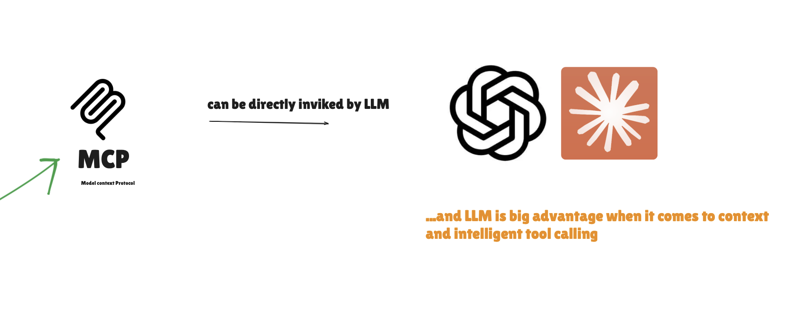
</p>

Opax solves this with a **"Bring Your Own Tool"** architecture using the Model Context Protocol. Hospitals connect their own systems as MCP servers, and Opax orchestrates them through a single conversational interface.

A doctor types or speaks what they need. Opax figures out which system to call, makes the call, and renders the result as a rich visual card — all in one chat window.

---

## Features

### AI-Powered Chat

<p align="center">
  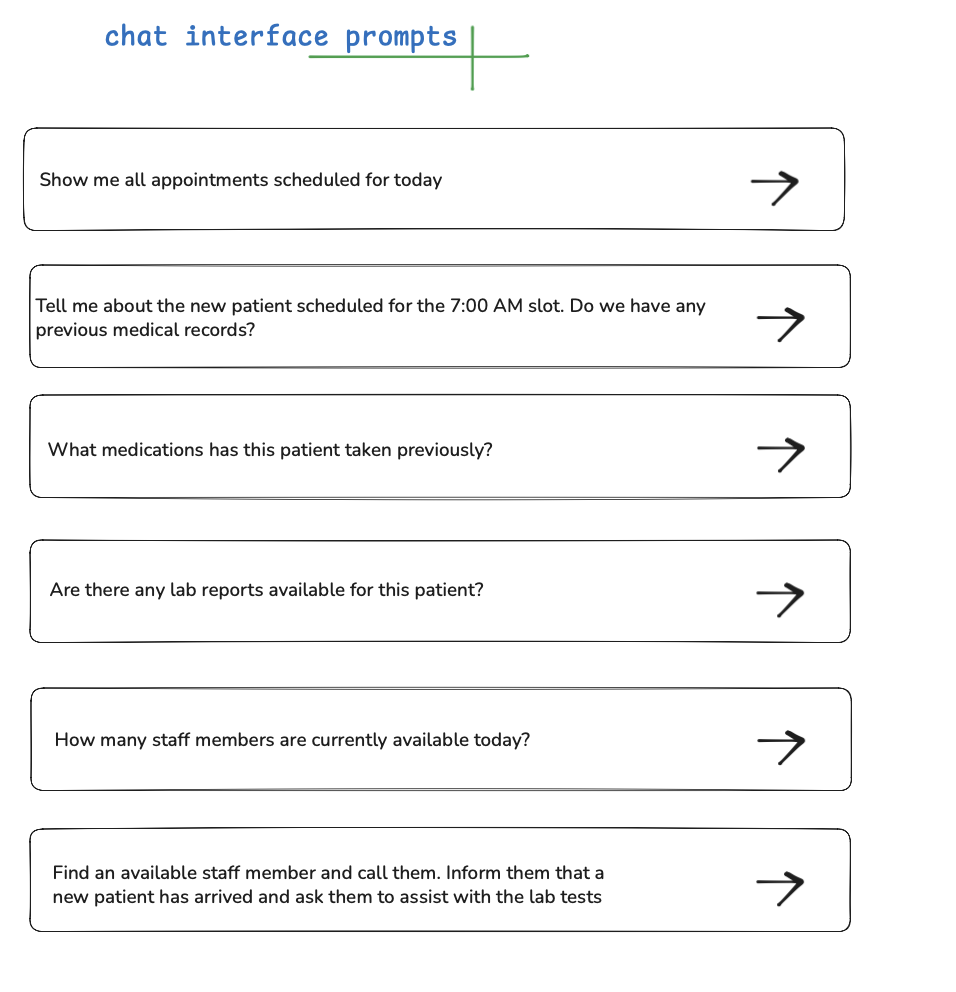
</p>

The core of Opax is a streaming chat interface. Clinicians type or speak naturally, and the AI understands intent, calls the right tools, and presents results as visual cards.

- Supports **OpenAI** (GPT-4o-mini, GPT-4o) and **Google Gemini** (Gemini 2.5 Flash Lite)
- Real-time streaming responses with tool call visualization
- Conversation history persisted locally via RxDB (IndexedDB)
- Multi-session support with sidebar navigation

### MCP Tool Integration

<p align="center">
  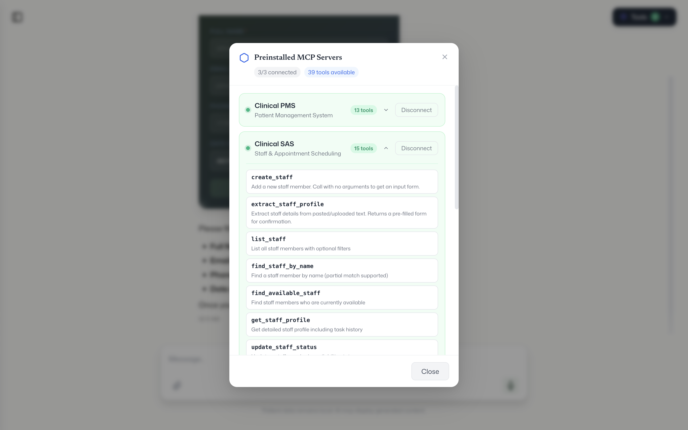
</p>

Opax connects to clinical backend systems via the **Model Context Protocol** — the universal adapter layer.

- Connect to local MCP servers via **stdio** (Python/Node.js scripts)
- Connect to cloud-hosted MCP servers via **StreamableHTTP**
- Three preinstalled clinical servers out of the box:
  - **Clinical PMS** — Patient management (appointments, records)
  - **Clinical SAS** — Staff and administration
  - **Clinical LTS** — Lab tests and results
- Tool discovery, execution, and result rendering happen automatically
- The AI decides which tools to call based on the conversation

One click on "Preinstalled MCP" and all three servers connect. The green status indicator shows they're live and ready. Every tool they expose is immediately available to the AI.

### Dynamic UI Card System

When MCP servers return data, Opax renders it as rich, interactive cards instead of raw text. The server drives the UI — each response includes a `metadata.componentType` field that tells Opax which card to render.

Here's what it looks like when a doctor asks "show me available doctors":

<p align="center">
  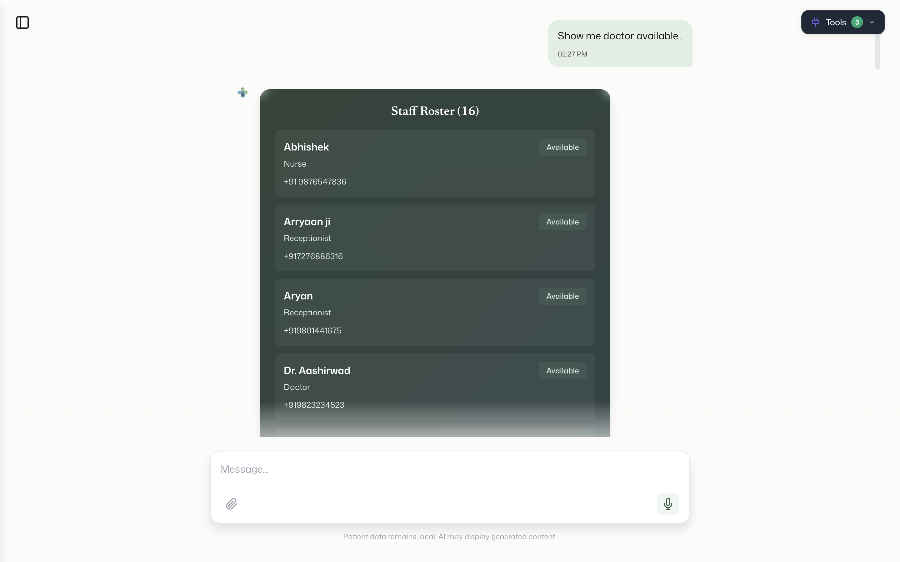
</p>

The AI calls the Staff Administration MCP server, gets the data, and renders staff profile cards with names, specialties, and availability status — all from a single natural language request.

And when a doctor needs to make a call, Opax renders an outgoing call card with a live pulse animation:

<p align="center">
  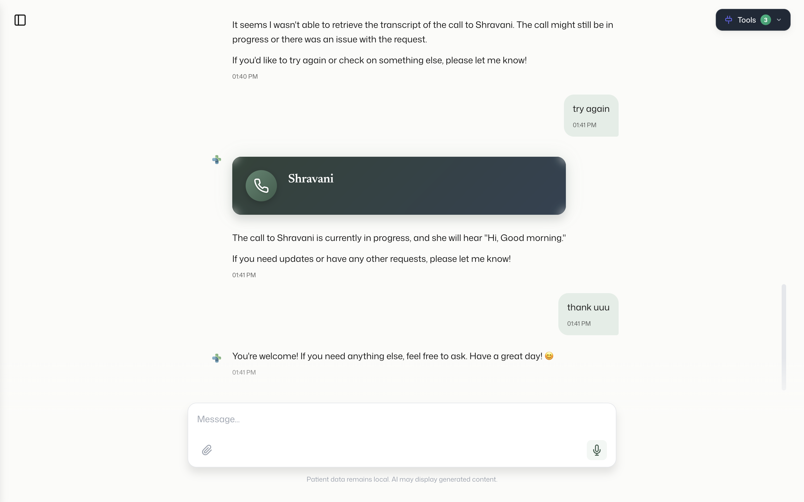
</p>

<p align="center">
  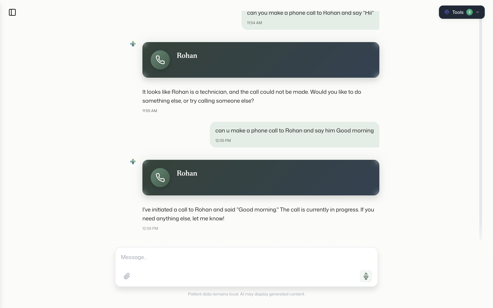
</p>

**11 card types currently supported:**

| Card Type | What It Shows |
|-----------|--------------|
| PatientInfoCard | Quick patient summary |
| PatientProfileCard | Full patient profile with contact details |
| PatientListCard | List of patients with status badges |
| StaffProfileCard | Staff member details and availability |
| StaffListCard | Available staff with specialty filters |
| CallCard | Outgoing call banner with pulse animation |
| LabResultCard | Lab values with abnormal highlighting (red) |
| LabResultsListCard | Multiple lab results overview |
| LabOrderCard | Lab order confirmation |
| LabOrderListCard | Pending lab orders |
| FormCard | Dynamic form generated from server schema |

### Human-in-the-Loop Forms

When a doctor asks the AI to create something (schedule an appointment, order a lab test), the MCP server returns a **form schema** instead of creating the record directly. Opax renders a dynamic form, and the **AI completely pauses** — no prompts are processed until the doctor fills out and submits the form.

<p align="center">
  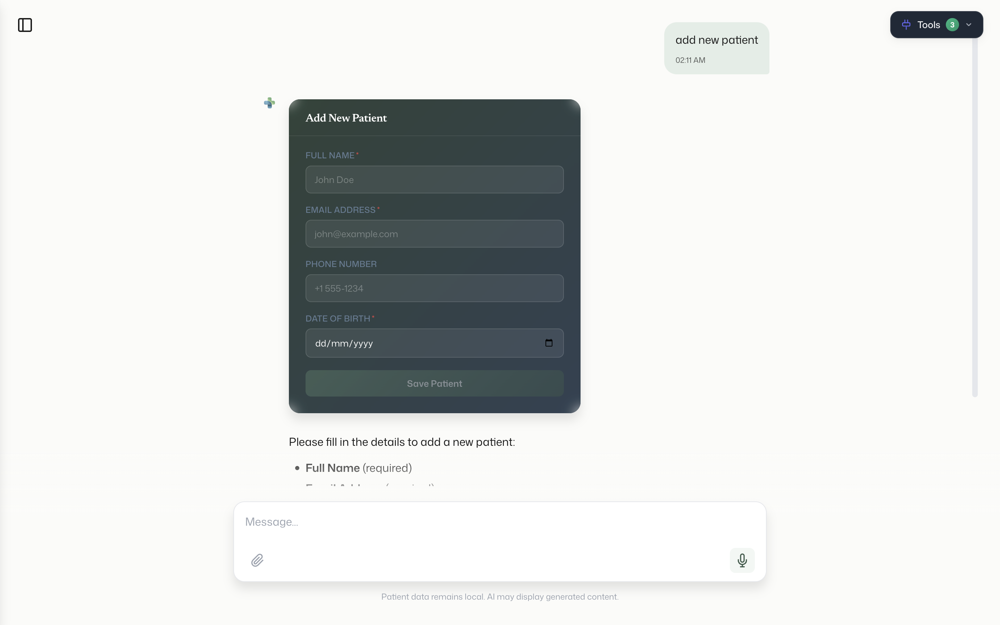
</p>

In the screenshot above, the doctor asked to add a new patient. Instead of the AI creating the record on its own, Opax rendered a form with all the required fields — name, date of birth, contact info, blood type, allergies. The AI is frozen. Nothing happens until the doctor reviews every field and clicks Submit.

This ensures:
- Doctors review and confirm all data before it's written
- No accidental record creation from AI hallucinations
- Full control over clinical data entry

**AI suggests. Humans decide. Always.**

### Voice Input (Whisper STT)

Tap the microphone button, speak your request, and the transcribed text appears in the input field. All transcription happens **on-device** using Whisper (whisper.cpp) — no audio leaves the machine.

- Supports multiple Whisper models (base.en, distil-large-v3)
- Audio captured via browser MediaRecorder API
- Processed in the Electron main process

### Conversation Persistence

All conversations are stored locally using RxDB with IndexedDB:

- Chat history survives app restarts
- Multiple conversation sessions with sidebar navigation
- Conversation previews and timestamps
- Delete individual conversations
- Automatic corruption recovery (detects and rebuilds if IndexedDB is corrupted)

### Welcome Experience

First-time users see a welcome modal to set their name. The name is persisted in the local database and displayed throughout the app (sidebar avatar, greeting screen).

### Settings and Configuration

<p align="center">
  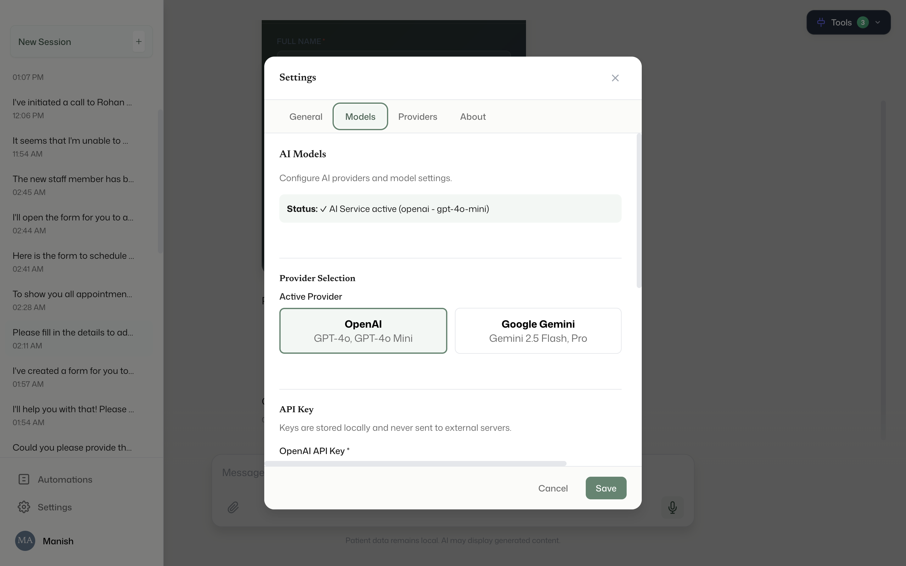
</p>

- Configure OpenAI or Gemini API keys
- Select AI model from the dropdown
- Provider switching (OpenAI ↔ Gemini) — pick the model that works for your use case
- API keys stored locally — never sent anywhere except the configured provider
- Profile management (name, avatar)

### Security

- Electron context isolation enabled
- Node integration disabled in renderer
- Secure preload script with explicit API surface
- Content Security Policy enforced
- Single instance lock (prevents multiple app instances from corrupting the database)
- All data stored locally on the device

---

## Architecture

<p align="center">
  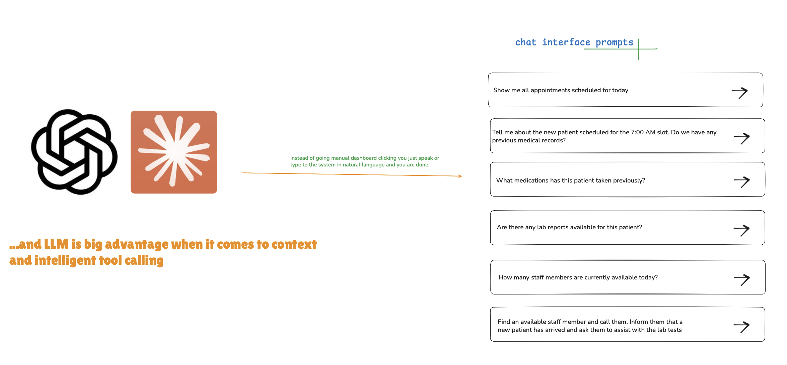
</p>

```
┌─────────────────────────────────────────────┐
│                  Renderer                    │
│  React App → Cards → Hooks → RxDB (local)   │
├─────────────────────────────────────────────┤
│              Preload (IPC Bridge)            │
│  Secure API surface: chat, mcp, form, etc.  │
├─────────────────────────────────────────────┤
│                Main Process                  │
│  AIService ← Vercel AI SDK                  │
│  MCPService ← stdio / StreamableHTTP        │
│  WhisperService ← whisper.cpp               │
├─────────────────────────────────────────────┤
│            External MCP Servers              │
│  Clinical PMS │ Clinical SAS │ Clinical LTS  │
└─────────────────────────────────────────────┘
```

### Tech Stack

| Layer | Technology |
|-------|-----------|
| Desktop Shell | Electron 34 |
| Frontend | React 18, TypeScript, Framer Motion |
| AI/LLM | Vercel AI SDK, OpenAI, Google Gemini |
| Tool Protocol | Model Context Protocol (MCP) SDK |
| Voice | Whisper (whisper.cpp via nodejs-whisper) |
| Database | RxDB with Dexie (IndexedDB) |
| Build | Vite, TypeScript, Electron Builder |
| Styling | CSS with custom properties (sage/slate-blue palette) |

### How MCP Works in Opax

1. **Doctor types or speaks** a request in natural language
2. **AI understands intent** and identifies which MCP tool to call
3. **Opax calls the MCP server** (via stdio or StreamableHTTP)
4. **Server returns data** with `metadata.componentType` specifying which card to render
5. **Opax renders the matching card** — patient profile, lab results, staff list, etc.
6. **For creation operations**, the server returns a form schema → Opax renders a dynamic form → AI pauses → doctor confirms → record is created

No hardcoded integrations. No vendor lock-in. Just connect your MCP server and go.

---

## Getting Started

### Prerequisites

- Node.js 18+
- npm

### Installation

```bash
# Clone the repository
git clone https://github.com/manishindiyaar/Opax.git
cd Opax

# Install dependencies
npm install

# Run in development mode
npm run dev
```

### Configuration

1. Open Opax
2. Go to **Settings** (gear icon in sidebar)
3. Enter your **OpenAI** or **Gemini** API key
4. Select your preferred model
5. Start chatting

### Connecting MCP Servers

Click the **Tools** button (plug icon, top-right) to:
- **Connect Server** — Enter a path to a local MCP server script (.py or .js)
- **Preinstalled MCP** — Connect to the three built-in clinical servers with one click

### Building for Production

```bash
# Build for macOS
npm run package:mac

# Build for Windows
npm run package:win
```

Installers are output to the `release/` directory.

---

## Platform Support

| Platform | Format | Status |
|----------|--------|--------|
| macOS (Apple Silicon) | DMG | ✅ Available |
| Windows (x64) | NSIS Installer (.exe) | ✅ Available |
| macOS (Intel) | DMG | Not yet built |
| Linux | AppImage / deb | Configured, not yet built |

Download from [GitHub Releases](https://github.com/manishindiyaar/Opax/releases).

> **Note:** Builds are not code-signed yet. Mac users: right-click → Open to bypass Gatekeeper. Windows users: click "More info" → "Run anyway" on SmartScreen.

---

## What's Next

### Jarvis Voice Agent (Spec Complete)
A full-screen voice interaction mode powered by Deepgram's Voice Agent API. Real-time bidirectional speech — speak naturally, hear responses. An animated "Jarvis sphere" reacts to conversation state (idle, listening, thinking, speaking). MCP tool execution happens mid-conversation while the agent is talking. The full spec, design, and implementation plan are complete.

### AgentBox (Coming Soon)

<p align="center">
  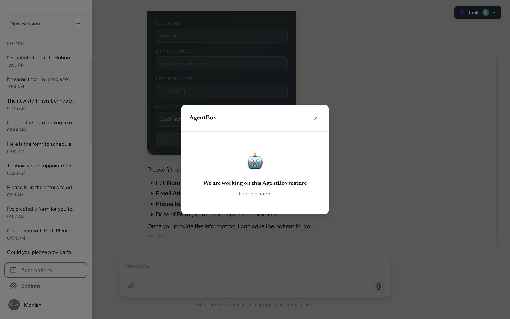
</p>

An automation engine for clinical workflows. Cron-based and event-driven rule triggers. Monitor lab results overnight, flag critical values, notify the right doctor before their shift starts. The UI shell is already in the app — the full automation engine is next on the roadmap.

### On-Device LLM
We're still working on getting a local model (FunctionGemma or similar) to reliably handle MCP tool calls. The architecture already supports it — the model just needs to be good enough. When it is, Opax will work with zero internet connection.

### Planned
- Code signing for macOS and Windows
- Auto-update mechanism
- Multi-language support
- FHIR/HL7 integration adapters
- Audit logging for compliance
- Custom MCP server marketplace

---

## Design Language

Opax uses a **"Clinical Zen"** design system — calm, intelligent, paper-like.

- **Primary palette:** Sage green `#5D8570` and Slate blue `#647D94`
- **Background:** Warm paper `#FBFBF9` with white surfaces
- **Cards:** Dark gradient backgrounds (sage-900 → slate-blue-900) for contrast
- **Typography:** Mona Sans (UI) + Newsreader (headings)
- **Animations:** Spring physics via Framer Motion, reduced-motion support

---

## Version History

| Version | Date | Highlights |
|---------|------|-----------|
| v1.0.0 | Feb 2026 | Initial release — chat, MCP, cards, voice input |
| v1.0.1 | Feb 2026 | Production build fix, AgentBox cleanup, Windows build, GitHub Release |

---


---

<p align="center">
  <strong>Opax — The operating system for the hospital edge.</strong><br/>
  <a href="https://github.com/manishindiyaar/Opax">github.com/manishindiyaar/Opax</a>
</p>
